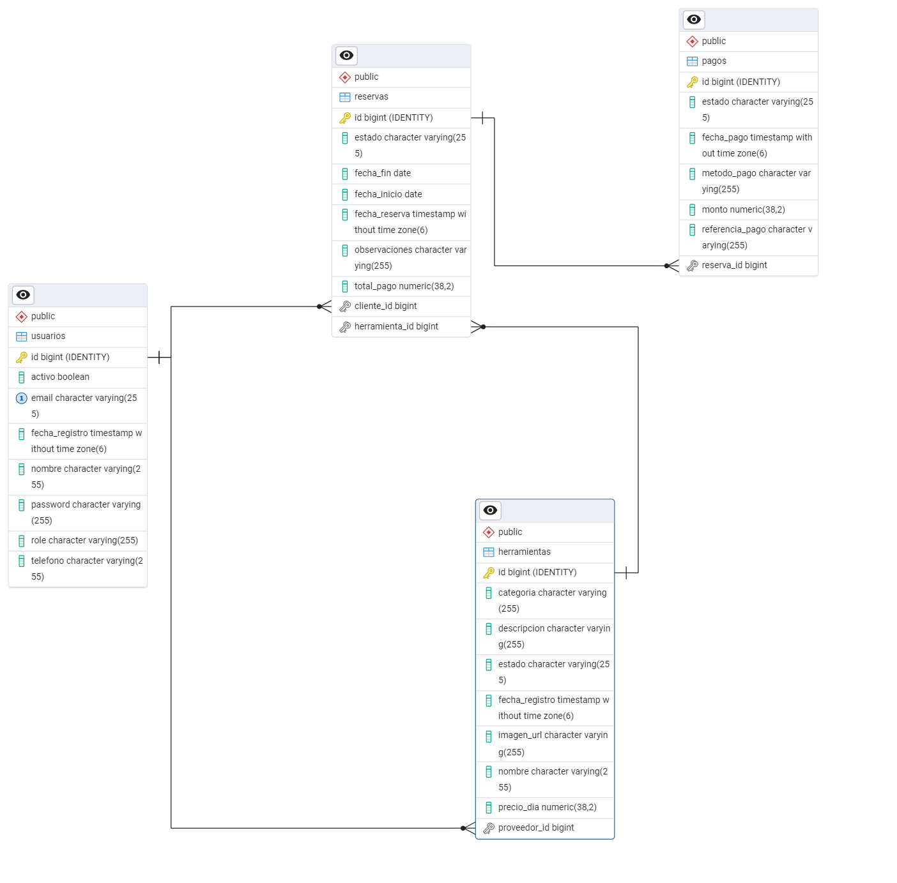

# Plataforma de Renta de Herramientas y Equipos de Construcción

Este proyecto es una plataforma web para la **gestión de alquiler de herramientas y equipos de construcción**, desarrollada con un backend en **Spring Boot** y una base de datos **PostgreSQL**, junto a un frontend ligero en **HTML, CSS y JavaScript**.

## Descripción del proyecto 📝
Indus Rental Es una plataforma digital diseñada para facilitar el alquiler de herramientas y maquinaria de construcción, dirigida tanto a proveedores como a particulares. 
Este proyecto tiene como objetivo optimizar la gestión del inventario, reservas, disponibilidad y pagos mediante un sistema de información.

## 🛠️ Funcionalidades principales

* Registro y autenticación de usuarios con **JWT**.
* Gestión de herramientas (registro, edición, eliminación).
* Visualización de herramientas disponibles.
* Sistema de reservas por parte del cliente.
* Panel de administración con control total sobre entidades.
* API documentada con Swagger.


## 🚀 Tecnologías utilizadas

### 🖙 Backend

* Spring Boot
* Spring Security + JWT
* Spring Data JPA
* PostgreSQL
* Swagger

### 🎨 Frontend

* HTML
* CSS
* JavaScript


## 📁 Estructura del Proyecto

```
Proyecto_RentaHerramientas/
│
└── proyecto/
    ├── src/main/java/com/proyecto/
    │                     └───── frontend/
    │                            ├── css/
    │                            ├── js/
    │                            └── login/
    │                               └── login.html
    ├── src/main/resources/
    │   ├── application.properties
    │   ├── proyectodb.png
    │   └── Presentacion_Proyecto_Renta_Herramientas.pdf
    ├── pom.xml
    └── README.md
```

## 🧪 Documentación de la API (Swagger)

Una vez que el backend está corriendo, puedes acceder a la documentación interactiva de la API en:

* [`http://localhost:8080/swagger-ui/index.html`](http://localhost:8080/swagger-ui/index.html)
* Endpoints habilitados:

  * `/swagger-ui/**`
  * `/api-docs/**`
  * `/swagger-ui.html`

Aquí podrás explorar todos los endpoints disponibles, realizar pruebas, y ver los esquemas de request y response.

---
## 📝 Presentacion PDF.

Aqui podras ver un presentacion breve del proyecto

```bash
cd resources/Presentacion_Proyecto_Renta_Herramientas.pdf
```

---

## 📒 Clonación del Proyecto

```bash
git clone https://github.com/JaimeBarreraS/Proyecto_RentaHerramientas_BarreraJaime_PerezYessica_GarciaDiego.git
cd Proyecto_RentaHerramientas_BarreraJaime_PerezYessica_GarciaDiego
```

---

## ⚙️ Configuración y Ejecución

### 🔹 Backend (Spring Boot)

1. Importa el proyecto como **Maven Project** en tu Visual Studi Code.
2. Configura la conexión a la base de datos PostgreSQL en `src/main/resources/application.properties`:

```properties
spring.datasource.url=jdbc:postgresql://localhost:5432/renta_herramientas
spring.datasource.username=tu_usuario
spring.datasource.password=tu_contraseña

spring.jpa.hibernate.ddl-auto=update
spring.jpa.show-sql=true

springdoc.api-docs.enabled=true
springdoc.swagger-ui.enabled=true
```

3. Ejecuta el proyecto desde la clase principal:

```java
@SpringBootApplication
public class RentaHerramientasApplication {
    public static void main(String[] args) {
        SpringApplication.run(RentaHerramientasApplication.class, args);
    }
}

```
---

### 🔹 Frontend (HTML, CSS, JS)

1. Navega a la carpeta:

```bash
cd frontend/login
```

2. Abre el archivo `login.html` en tu navegador con doble clic o usando Live Server (en VSCode).

3. El formulario de login se conecta con el backend para autenticar al usuario mediante JWT.

---

## 🔐 Seguridad

El sistema utiliza **JWT (JSON Web Tokens)** para autenticación. Una vez logueado, el usuario recibe un token que debe adjuntar en las peticiones protegidas (en el encabezado `Authorization: Bearer <token>`).

---

## 🗺️ Diagrama Entidad-Relación (ERD)

El modelo de datos está representado visualmente en el siguiente diagrama:

📍 **Ubicación**: carpeta `resources/proyectodb.png`




## 👥 Roles de Usuario

* **ADMINISTRADOR**: Accede a todos los módulos y funciones administrativas.
* **PROVEEDOR**: Registra herramientas y gestiona su disponibilidad.
* **CLIENTE**: Consulta herramientas y realiza reservas.

---

## **Autores** 🎉🤝
Este proyecto fue desarrollado en colaboración:
   - 👑 **Jaime Enrique Barrera Sandoval:** Diseño y desarrollo de la base de datos, inserciones, backend y frontend.
   - 👑 **Yessica Andrea Perez Machuca:** Diseño y desarrollo de la base de datos, backend y frontend.
   - 👑 **Diego Alexander García Rodriguez** Diseño y desarrollo de la base de datos, backend y frontend.

